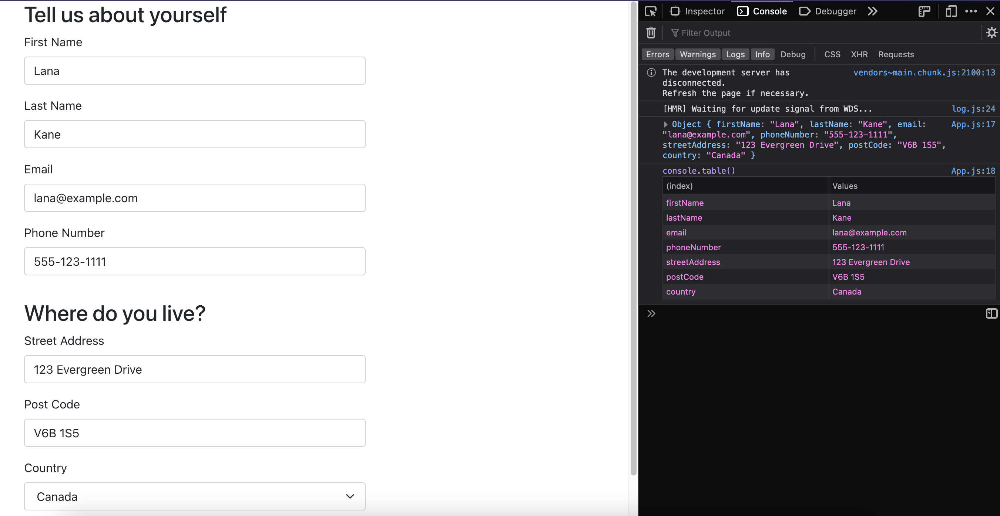

# Question 3 (Front-end): Generate A Form from JSON file

<p align=center>
  
</p>

## How to run the application in the development mode:
__1. Clone the repository:__
```
$ git clone https://github.com/nnfunny/practice-test-trip-social.git
```
__2. Change directionry:__
```
$ cd question-3
```
__3. Install denpendencies:__
```
$ yarn 
```
__4. Run the application:__
```
$ yarn start
```
Open http://localhost:3000 to view it in the browser.

